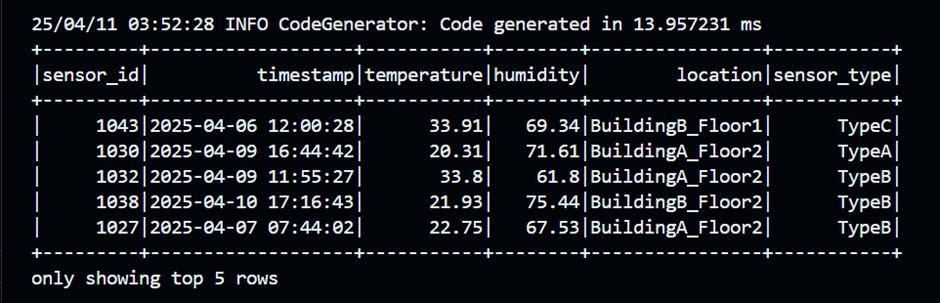
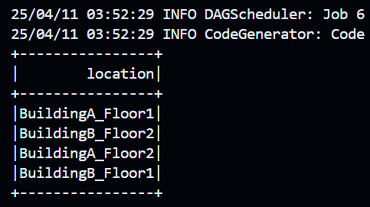

# 🔍 IoT Sensor Analytics using Apache Spark SQL

This project explores IoT sensor data through the lens of **Apache Spark SQL**, enabling scalable and efficient analytics on time-series sensor data. The tasks span from initial data ingestion to pivot table generation, showcasing multiple data analysis techniques.

---

## 📘 Dataset Overview

The dataset `sensor_data.csv` contains historical readings from various IoT sensors. The columns are as follows:

| Column       | Description                                      |
|--------------|--------------------------------------------------|
| sensor_id    | Unique identifier for the sensor                 |
| timestamp    | Date and time of the reading                     |
| temperature  | Temperature reading in Celsius                   |
| humidity     | Humidity percentage                              |
| location     | Physical location of the sensor                  |
| sensor_type  | Type of the sensor (e.g., TypeA, TypeB)          |

---

## ⚙️ Setup & Installation

### Requirements

- Python 3.x
- Apache Spark
- PySpark

### Install Dependencies

```bash
pip install pyspark
```

### Running the Analysis

You can generate the dataset using:

```bash
spark-submit data_generator.py
```


---

## 📊 Task Breakdown

---

### 🔹 Task 1: Data Loading & Initial Exploration

- Load the dataset with inferred schema.
- Create a temporary SQL view (`sensor_readings`).
- Run SQL queries to preview data and gather counts.

**Output**: `task1_output.csv`  
Contains a snapshot of the initial sensor records.

#### Screenshots for task1:




---

### 🔹 Task 2: Data Filtering & Aggregation

- Filter temperatures outside the [18, 30] range.
- Count in-range vs out-of-range records.
- Group by `location` to find average temperature & humidity.

**Output**: `task2_output.csv`  
Insight into which locations are consistently hotter or more humid.

---

### 🔹 Task 3: Time Series Analysis

- Convert string timestamp to `TimestampType`.
- Extract the `hour_of_day` and compute average temperatures per hour.
- Identify the peak hour.

**Output**: `task3_output.csv`  
Reveals daily temperature cycles and hottest periods.

---

### 🔹 Task 4: Sensor Ranking with Window Functions

- Calculate average temperature per sensor.
- Use `DENSE_RANK()` to rank sensors by temperature.

**Output**: `task4_output.csv`  
Ranks sensors to spot the most heat-sensitive ones.

---

### 🔹 Task 5: Pivot Table by Location and Hour

- Pivot the data using `location` as rows and `hour_of_day` as columns.
- Fill cells with average temperatures.
- Identify extreme values.

**Output**: `task5_output.csv`  
A heatmap-like summary across locations and time.

---

## 📌 Observations

- **BuildingB_Floor2** tends to be warmer throughout the day.
- **Night hours** are generally cooler across all locations.
- Some sensors consistently report higher values, indicating calibration differences or local heat sources.

---

## 🗂 File Structure

```
.
├── sensor_data.csv
├── data_generator.py
├── task1_output.csv
├── task2_output.csv
├── task3_output.csv
├── task4_output.csv
├── task5_output.csv
├── task1.py
├── task2.py
├── task3.py
├── task4.py
├── task5.py
└── README.md
```

---

## 👤 Maintainer

**Likitha Sri Kode**  
GitHub: [Likithakode](https://github.com/Likithakode)  

---

## 🧾 License

This repository is intended for assingment purpose for the course Cloud Computing and it is solely for academic use. 
